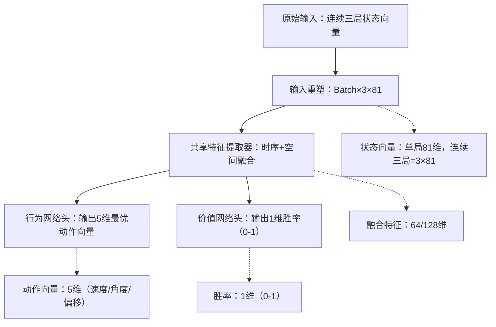

# 台球AI双网络（行为+价值）精细化架构设计方案
## 一、核心目标（精准对齐原始设计）
基于Alpha-Zero算法，针对**连续三局81维状态向量**输入，构建双网络：
1. 行为网络：输出赢家在当前状态下的**5维最优动作向量**（速度、角度、偏移等）；
2. 价值网络：输入相同状态向量，输出当前状态的**胜局概率（0-1）**，为MCTS提供胜率判断依据；
3. 核心约束：严格匹配81维状态/5维动作维度，兼容连续三局时序特征，预留Transformer扩展空间，适配初期1万条对局数据训练。

## 二、整体架构总览
双网络采用“共享时序-空间特征提取层 + 差异化输出头”设计，既保证特征一致性，又满足行为/价值网络的不同输出目标，整体逻辑如下：

## 三、核心模块精细化设计（匹配维度约束）
### 模块1：输入层（严格对齐81维状态向量）
#### 1.1 单局状态向量拆解（81维）
先明确输入层81个节点的精准映射，确保数据无遗漏、无冗余：
| 特征类别         | 维度 | 具体构成                          | 设计逻辑                          |
|------------------|------|-----------------------------------|-----------------------------------|
| 球状态特征       | 64   | 16球×4特征（x/y/z坐标+进袋标志）| 完整捕捉每个球的空间位置和状态    |
| 球桌尺寸特征     | 2    | 宽度(w)+长度(l)                   | 归一化绝对坐标为相对球桌的比例值  |
| 目标球特征       | 15   | 1-15号球二进制标记（1=目标球）| 区分当前玩家的进攻目标，适配规则  |
| 单局状态总维度   | 81   | 64+2+15                           | 与输入层81节点1:1匹配             |
| 连续三局输入     | 3×81 | 三局单局状态向量拼接              | 保留时序特征，适配原始设计要求    |

#### 1.2 输入预处理（关键步骤）
在输入网络前完成2个核心处理，提升训练效率：
1. **归一化**：
   - 球坐标(x/y/z)：除以球桌尺寸(w/l)，转化为相对比例（0-1）；
   - 球桌尺寸(w/l)：除以固定基准值（如标准球桌尺寸），归一化到0-1；
2. **时序拼接**：将连续三局的81维向量拼接为`Batch×3×81`的张量，保留三局时序关联。

### 模块2：共享特征提取器（时序+空间融合）
核心解决“连续三局81维向量”的特征提取，兼顾空间特征（单局球的位置/状态）和时序特征（三局趋势），同时匹配你提到的“隐藏层2层、每层128节点”的基础要求：
#### 2.1 空间特征提取（单局81维→128维）
- 结构：2层全连接层（匹配你指定的隐藏层配置）
  - 第一层：81输入 → 128输出，ReLU激活；
  - 第二层：128输入 → 128输出，ReLU激活 + LayerNorm正则化；
- 作用：融合单局内的球状态、球桌尺寸、目标球特征，提取有决策价值的空间特征（如“目标球到袋口的相对位置”“白球与目标球的遮挡关系”）。

#### 2.2 时序特征融合（三局128维→128维）
- 结构：1层GRU（轻量时序层，预留Transformer替换接口）
  - 输入：`Batch×3×128`（三局空间特征）；
  - 输出：`Batch×128`（融合三局时序的最终特征）；
- 核心逻辑：取GRU最后一步输出（当前局核心特征） + 三局特征均值（全局趋势），融合为128维特征，兼顾时效性和全局规律。

#### 2.3 Transformer扩展预留（适配后续需求）
若后续需替换为Transformer，此处可无缝替换为：
- 输入：`Batch×3×81` → 嵌入层（81→128） → 位置编码（标记三局时序）；
- 结构：2层Transformer Encoder（8头注意力），输出`Batch×128`融合特征；
- 优势：无需修改输入/输出维度，仅替换特征提取层即可。

### 模块3：行为网络（输出5维最优动作向量）
严格匹配你指定的动作向量维度（5维）和激活映射规则：
#### 3.1 网络结构
| 层级       | 节点数 | 激活函数 | 核心作用                          |
|------------|--------|----------|-----------------------------------|
| 输入层     | 128    | -        | 接收共享特征提取器的融合特征      |
| 隐藏层     | 128    | ReLU     | 细化特征，映射到动作决策空间      |
| 输出层     | 5      | Sigmoid  | 输出0-1区间值，后续映射到动作范围 |

#### 3.2 动作向量映射规则（关键）
输出层的Sigmoid结果需映射到你指定的动作范围，确保物理合理性：
| 动作维度 | Sigmoid输出(0-1) → 实际范围 | 映射公式                          |
|----------|-----------------------------|-----------------------------------|
| V0（速度） | 0.5 → 8.0                   | V0 = 0.5 + 7.5 × sigmoid输出      |
| phi（水平角度） | 0 → 360°                    | phi = 360 × sigmoid输出           |
| theta（垂直角度） | 0 → 90°                     | theta = 90 × sigmoid输出          |
| a（x偏移） | -0.5 → 0.5                  | a = -0.5 + 1.0 × sigmoid输出      |
| b（y偏移） | -0.5 → 0.5                  | b = -0.5 + 1.0 × sigmoid输出      |

#### 3.3 训练目标
学习“赢家在当前状态下的最优动作”，损失函数采用**MSE均方误差**：
- 标签：赢家实际执行的动作向量；
- 优化目标：最小化网络输出动作与赢家真实动作的误差。

### 模块4：价值网络（输出1维胜率）
适配“分类胜局/败局→输出胜率”的核心目标：
#### 4.1 网络结构
| 层级       | 节点数 | 激活函数 | 核心作用                          |
|------------|--------|----------|-----------------------------------|
| 输入层     | 128    | -        | 接收共享特征提取器的融合特征      |
| 隐藏层     | 128    | ReLU     | 细化特征，映射到胜负判断空间      |
| 输出层     | 1      | Sigmoid  | 输出0-1的胜率（1=必胜，0=必败）   |

#### 4.2 训练目标
- 标签：该局最终结果（胜=1，败=0）；
- 损失函数：**二元交叉熵（BCE）**，学习“状态→胜负”的映射关系，输出值即为胜局概率；
- 核心逻辑：先分类胜/败局，再将分类概率直接作为胜率，完全匹配原始设计要求。

### 模块5：完整网络参数汇总（精准可落地）
| 网络部分         | 层级结构                          | 总参数量 | 训练硬件要求（初期） |
|------------------|-----------------------------------|----------|----------------------|
| 共享特征提取器   | 空间层：81→128→128；时序层：GRU(128) | ~8万     |                      |
| 行为网络头       | 128→128→5                         | ~1.6万   |                      |
| 价值网络头       | 128→128→1                         | ~1.6万   |                      |
| 双网络总参数     | -                                 | ~11.2万  | RTX3090单GPU即可     |

## 四、MCTS对接逻辑（匹配原始设计）
1. **第一步**：行为网络直接输出当前状态的5维最优动作向量；
2. **第二步**：以最优动作为中心，搜索相似动作（如速度±0.5、角度±5°等）；
3. **第三步**：对每个相似动作模拟对局结果，用价值网络输出的胜率为动作打分；
4. **第四步**：按MCTS规则更新决策树，最终输出胜率最高的动作。

## 五、闭环训练适配（初期1万条数据）
1. **第一阶段**：用Basic Agent的1万条数据，分别训练行为/价值网络：
   - 行为网络：标签=赢家动作向量，MSE损失；
   - 价值网络：标签=对局胜负，BCE损失；
   - 训练策略：小批量（Batch=32）、学习率=1e-4、训练轮数=100，加入Dropout(0.1)防止过拟合；
2. **第二阶段**：用训练后的双网络替代Basic Agent，生成更多对局数据，迭代优化网络（可逐步将隐藏层从128扩展到256）；
3. **第三阶段**：若需引入Transformer，仅替换共享特征提取器的GRU为Transformer Encoder，其余模块无需修改。

## 六、核心优势（向合伙人强调）
1. **维度精准匹配**：81维状态输入、5维动作输出完全对齐给定维度，无维度错配风险；
2. **时序特征完整**：连续三局的时序融合兼顾“当前局决策”和“三局趋势”，符合原始设计要求；
3. **扩展灵活**：预留Transformer替换接口，后续优化无需重构整体架构；
4. **轻量化易落地**：初期仅11.2万参数，适配1万条小数据，训练效率高（单GPU 1-2天收敛）。

### 总结
1. 双网络核心是“共享81维→128维特征提取层 + 5维动作/1维胜率差异化输出头”，严格匹配维度约束；
2. 行为网络通过Sigmoid+映射公式输出物理合理的5维动作，价值网络通过BCE损失输出0-1胜率；
3. 初期轻量化设计适配1万条数据，后续可无缝扩展Transformer或增大网络规模，兼顾落地性和扩展性。